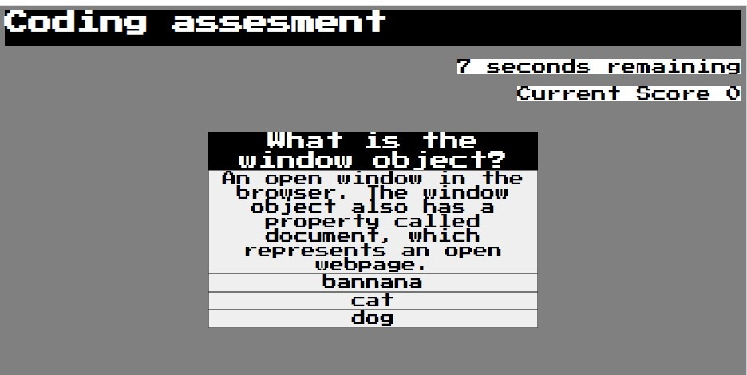
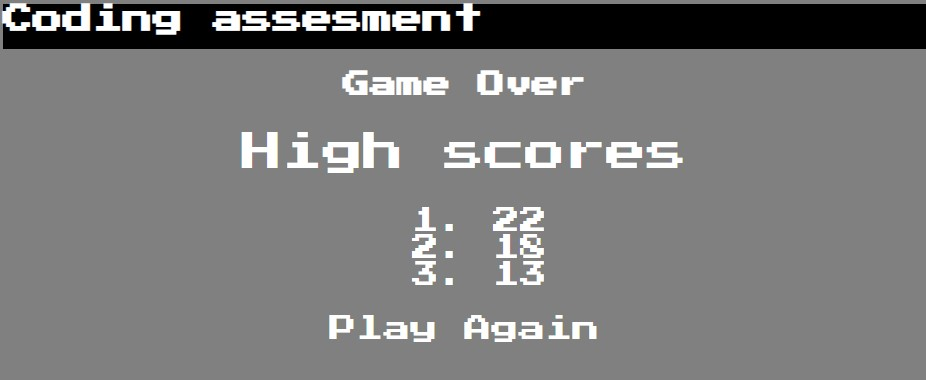
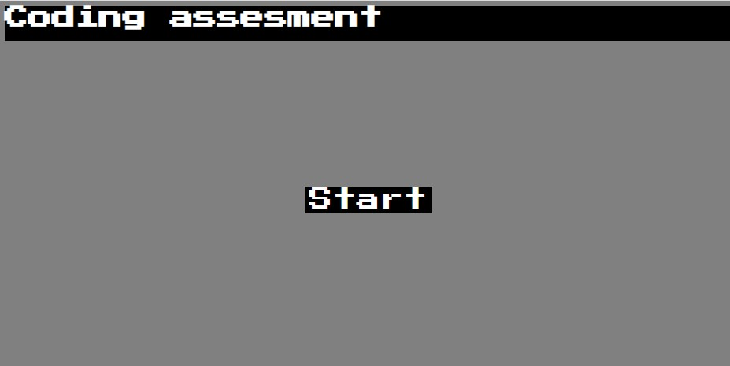

# Coding-assesment

## Description
Timed coding quiz with multiple choice questions. When going through the quiz if you get a answer correct you get one point, when you answer incorrcetly you lose 5 seconds from the time. This was styled as a retro game utilizing Press Start 2p google font. 

The motivation behind this project was to further my understanding and better my skills in JavaScript as well as CSS and HTML. A benefit to this project is the ability to go back and use the quiz to study HTML, CSS and JavaScript topics. My hope was to make the style fun and more enjoyable quiz taking. The problem solved was creating a website that can be utilized to practice the topics mentioned, as well as add any additional topics in the future. I learned how to utilize an array of objects, call on functions in different zones, and utilize display properties given a situation. 

## Installation

No installation is needed, this is a web application which can be found at:

https://jeromemn.github.io/Coding-assesment/


## Usage

Provide instructions and examples for use. Include screenshots as needed.

To add a screenshot, create an `assets/images` folder in your repository and upload your screenshot to it. Then, using the relative filepath, add it to your README using the following syntax:

      ```md
    
    ```mp4
      ```md
    
    ```
      ```md
    )
    ```

    ```md
    
    ```

## Credits

credit to Google fonts for utilizing Press Start 2p font.

https://fonts.google.com/specimen/Press+Start+2P?preview.text=Game%20Over&preview.text_type=custom

